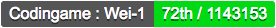

# Codingame-Badge

https://wei-1.github.io/Codingame-Badge/

## Usage

Login to Codingame and get the Codingame ID in the URL of ones profile page.

https://www.codingame.com/profile/

Put the Codingame ID in the `input box` in the web page, and click `submit`.

Wait for some time and see the badge changing based on ones Codingame rank.

## Example

For `Wei-1`, one will be able to see his profile at

https://www.codingame.com/profile/3f4adfba53d1ae216fb40f9c51b72c843953371

Therefore, `Wei-1`'s Codingame ID is `3f4adfba53d1ae216fb40f9c51b72c843953371`.

## Notes

This project aims to create badges for Codingame Rank.

One difficulty while testing is that CG's api does not allow cross origin.

Therefore, we use the open demo server from cors-anywhere.

https://cors-anywhere.herokuapp.com/

## Refs

https://github.com/Orabig/codingame-api-rfc

https://github.com/Rob--W/cors-anywhere

https://gist.github.com/soundstorm/266148cd9dbbdcf5cbc18ce26d75d3ea